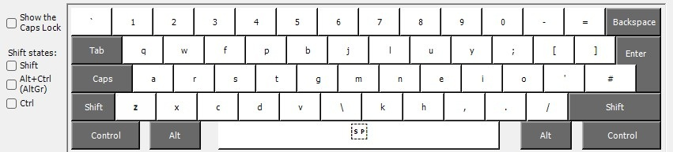
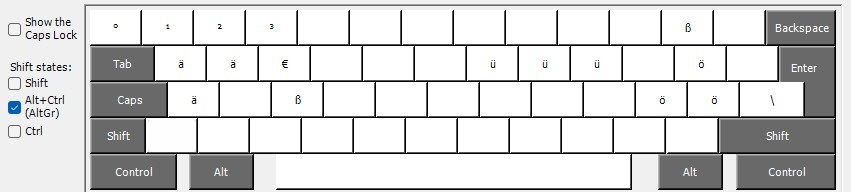

# Some infos and files for my personal keyboard setup

Colemak-DH: [https://colemakmods.github.io/mod-dh/](https://colemakmods.github.io/mod-dh/)

## Windows

[Microsoft Keyboard Layout Creator 1.4](https://www.microsoft.com/en-us/download/details.aspx?id=102134)

Converts *.klc files to installer. See windows/installer/cdh_mbl4/setup.exe





## Linux

```bash
setxkbmap us -variant colemak_dh_iso
setxkbmap uk -variant colemak_dh_iso
```

TODO sway config file

